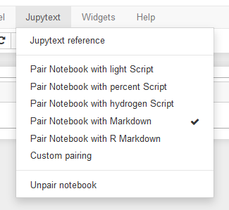

# A Jupyter notebook extension for Jupytext

This extension adds a [Jupytext](https://github.com/mwouts/jupytext) menu to Jupyter notebook. Use the menu to select the desired ipynb/text pairing for your notebook.



# Installation

Please [install Jupytext](https://github.com/mwouts/jupytext/blob/master/README.md#installation) first. Make sure Jupyter is configured to use Jupytext's contents manager. Then, install the extension with:

```bash
jupyter nbextension install --user https://raw.githubusercontent.com/mwouts/jupytext_nbextension/master/jupytext.js
jupyter nbextension enable jupytext
```

and restart your notebook server.

# How to develop this extension

Clone this repository and install the extension as a symbolic link:

```bash
jupyter nbextension install --symlink --user jupytext.js
jupyter nbextension enable jupytext
```

Then, make the desired changes to `jupytext.js` and reload the extension by simply refreshing the notebook (Ctrl+R). In case your OS does not allow symlinks, edit the copy of `jupytext.js` that is actually used by Jupyter (refer to the output of `jupyter nbextension install --user jupytext.js`).
