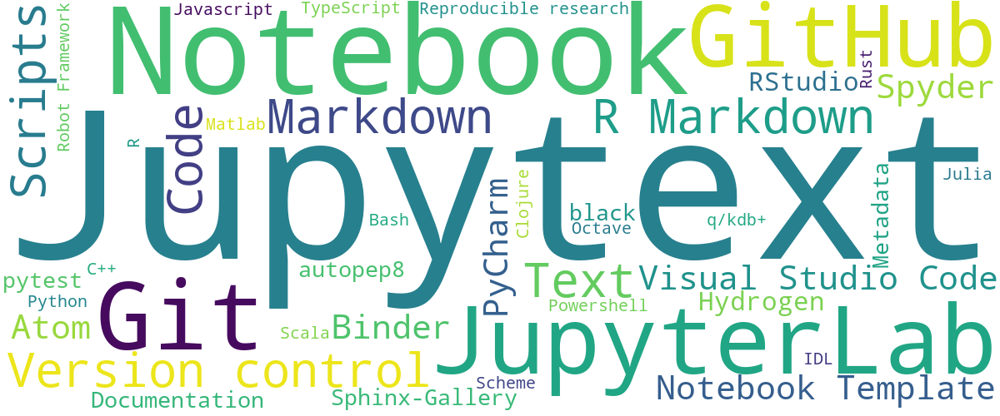

# Jupyter notebooks as Markdown documents, Julia, Python or R scripts

## Contents

* [Introduction](introduction)
* [Usecases for Jupytext](examples)
* [Installation](install)
* [Using Jupytext in Jupyter](using-server)
* [Using at the command line](using-cli)
* [Using as a Python libary](using-library)
* [Supported document formats](formats)
* [Frequently Asked Questions](faq)
