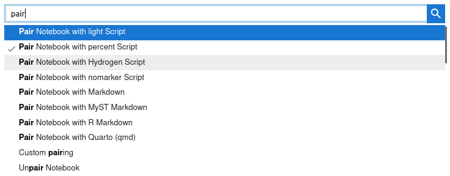

# Installation

Installing Jupytext is as simple as
```bash
pip install jupytext
```
or
```bash
conda install jupytext -c conda-forge
```

You should run either one of these commands in the Python environment from which you launch Jupyter Lab. Once you have installed Jupytext, you need to restart Jupyter to be able to use Jupytext within Jupyter.

If the Python environment where the Jupyter server runs is read-only, for instance if your server is started using JupyterHub, you can still install Jupytext in user mode with:
```
/path_to_your_jupyter_environment/python -m pip install jupytext --user
```

Jupytext comes with a series of tools and plugin, which we will now briefly describe.

## Jupytext's contents manager

Jupytext provides a contents manager that let Jupyter open and save notebooks as text files. When Jupytext's content manager is active in Jupyter, scripts and Markdown documents have a notebook icon.

Jupytext's contents manager is activated automatically by Jupytext's server extension. When you start either `jupyter lab` or `jupyter notebook`, you should see a line that looks like:
```bash
[I 10:28:31.646 LabApp] [Jupytext Server Extension] Changing NotebookApp.contents_manager_class from LargeFileManager to jupytext.TextFileContentsManager
```

If you don't have the notebook icon on text documents after a fresh restart of your Jupyter server, please enable our server extension explicitly with
```
jupyter serverextension enable jupytext
```

## Jupytext commands in JupyterLab

Jupytext comes with a frontend extension for JupyterLab which provides pairing commands (accessible with View / Activate Command Palette, or Ctrl+Shift+C):



The Jupytext extension for JupyterLab is bundled with Jupytext. It should be installed and enabled automatically. You can `enable` or `disable` it manually with either
```
jupyter labextension enable jupyterlab-jupytext
jupyter labextension disable jupyterlab-jupytext
```

From Jupytext 1.9.0 on, the version of the extension is compatible with JupyterLab 3.x only. If you wish to use Jupytext with JupyterLab 2.x or 1.x, please
- install the `jupytext` package using `pip` or `conda`
- and then, install the last version of the `jupyterlab-jupytext` extension that is compatible with your version of JupyterLab, i.e.
```
jupyter labextension install jupyterlab-jupytext@1.2.2  # for JupyterLab 2.x
jupyter labextension install jupyterlab-jupytext@1.1.1  # for JupyterLab 1.x
```

## Jupytext menu in Jupyter Notebook

*Note*: as of this writing (version 1.15.1) this section **applies only to
notebook classic**, i.e. Jupyter Notebook 6.x and below. See [PR
#1095](https://github.com/mwouts/jupytext/issues/1095) where we discuss how to
add a Jupytext menu to Jupyter Lab and Notebook 7.x.

Jupytext includes an extensions for Jupyter Notebook that adds a Jupytext section in the File menu.


Here again, the extension should be automatically installed. If need be, you can install and activate it manually with
```
jupyter nbextension install --py jupytext [--user]
jupyter nbextension enable --py jupytext [--user]
```

## Jupytext's command line interface

Jupytext provides a `jupytext` command in the terminal that you can use to pair, synchronize or convert notebooks in different formats.

The CLI is documented [here](using-cli.md).

Run `jupytext --version` to check which version of Jupytext is installed.

## Jupytext as a Python library

Jupytext is also available as a Python library. The `jupytext` package exposes the same `read`, `write`, `reads` and `writes` functions than `nbformat`, meaning that you can read and write notebooks within Python like this:

```
import jupytext

# read a notebook from a file
nb = jupytext.read("notebook.py")

# or from a string
nb = jupytext.reads(text, fmt="md:myst")

# write a notebook to a file in the 'py:percent' format
jupytext.write(nb, "notebook.py", fmt="py:percent")
```

In the above, `nb` is an instance of an `nbformat` `NotebookNode`. The notebook format is documented in the [nbformat documentation](https://nbformat.readthedocs.io).
