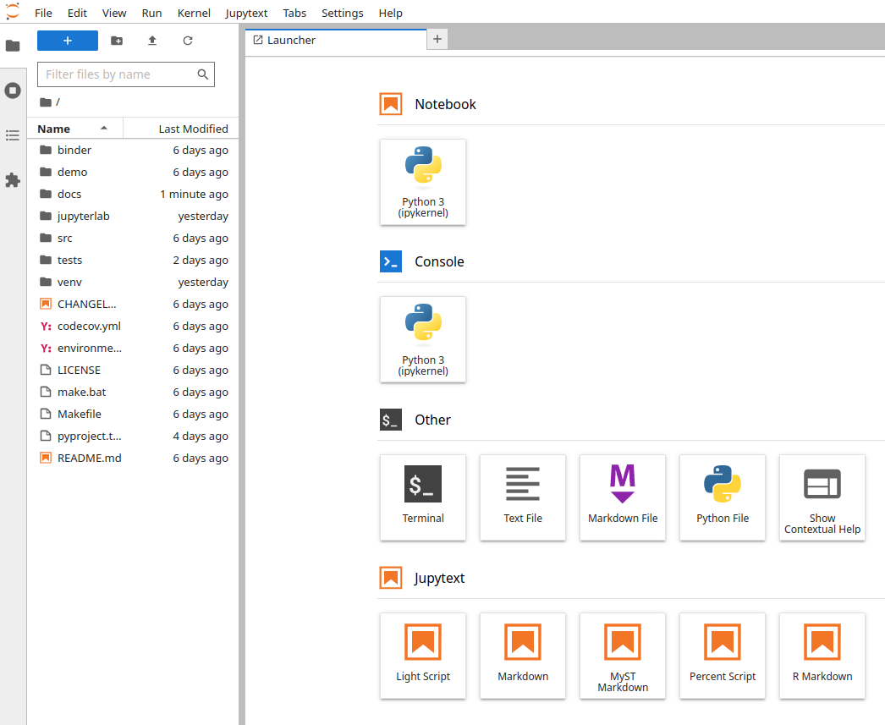
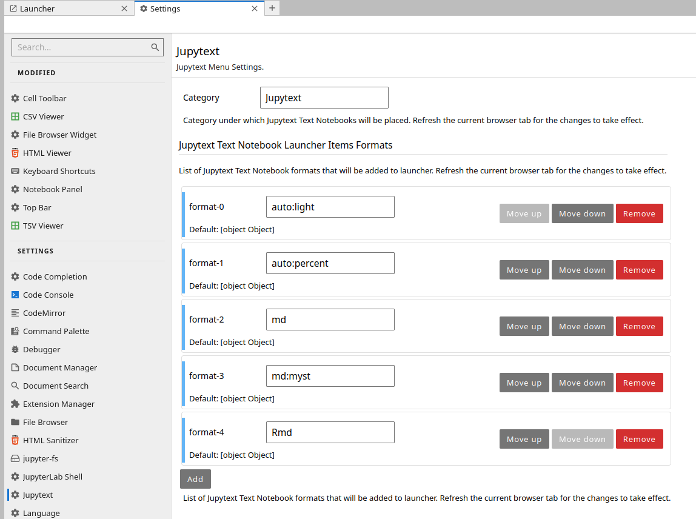
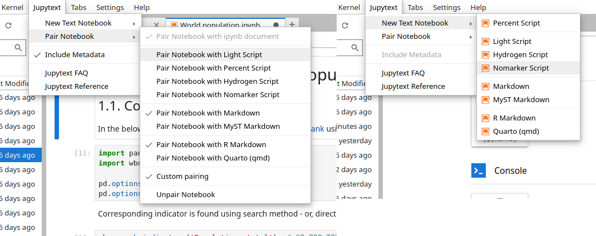

# Frontend extension

Recent versions of Jupytext (`>=1.16.0`) ships frontend extension that enables users
to create text notebooks and pair notebooks from main menu of JupyterLab 4 and
Notebook 7. In addition, the frontend extension adds selected Jupytext text
notebook formats to launcher in the `Jupytext` section so that users can launch text
notebooks as they launch a regular notebook from JupyterLab launcher.

## Launcher icons

After installing Jupytext extension, users will have a new category in the launcher
called Jupytext as shown below:

Users can remove and/or add new formats to the Jupytext section _via_ `Settings>Jupytext`.

By clicking `Add` and adding a new format, say `qmd`, will
add the Quatro Text Notebook to the launcher. **Note** that users need to refresh the current browser tab when they modify the settings for them to take effect.

Besides, users can also change the category of Text Notebook launcher icons using
`Category` field in the Settings. For example, by using `Notebook` as category, all
Text Notebook launchers will be moved into `Notebook` category.

## Main menu

It is also possible to launch text notebooks and/or pair existing notebooks from the dedicated Jupytext main menu as shown below.

