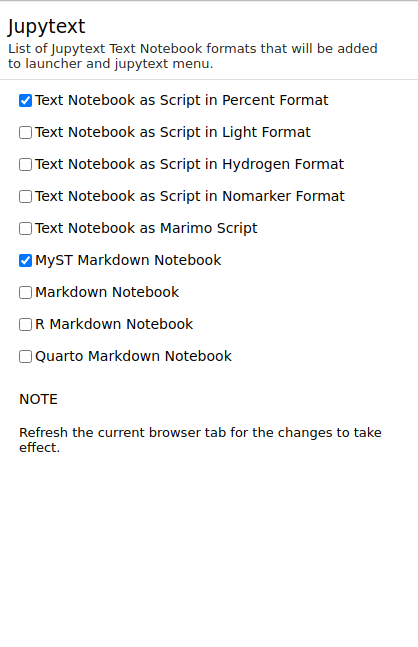
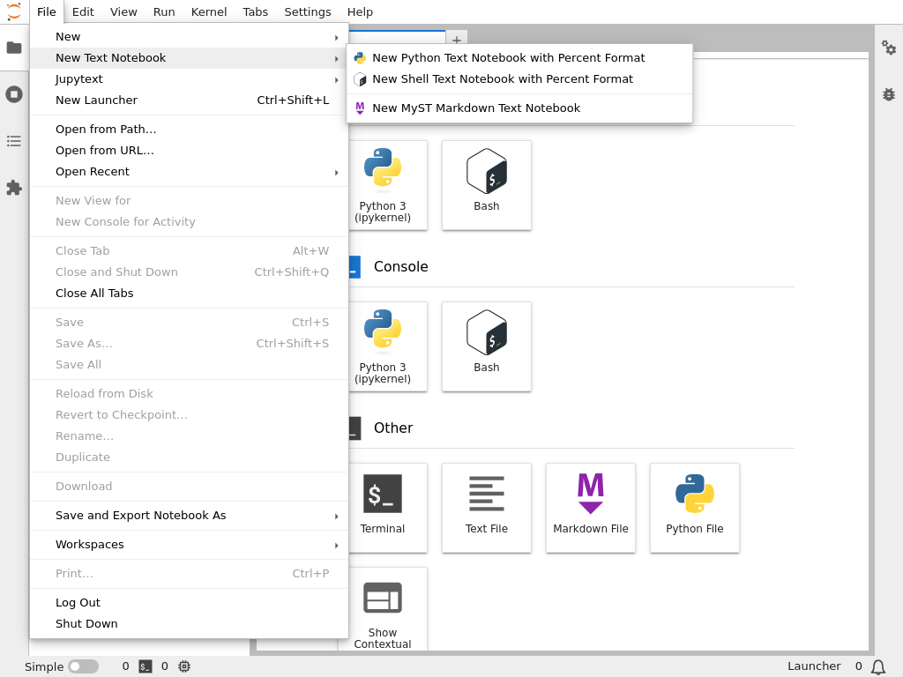

# Frontend extension

Recent versions of Jupytext (`>=1.16.0`) ships frontend extension that enables users
to create text notebooks and pair notebooks from main menu of JupyterLab 4 and
Notebook 7. In addition, the frontend extension adds selected Jupytext text
notebook formats to launcher in the `Jupytext` section so that users can launch text
notebooks as they launch a regular notebook from JupyterLab launcher.

## Launcher icons

After installing Jupytext extension, users will have a new category in the launcher
called Jupytext as shown below:

Users can remove and/or add new formats to the Jupytext section _via_ `Settings>Jupytext`.

By (un)selecting different formats, users can filter the items in launcher and main menu. **Note** that users need to refresh the current browser tab when they modify the settings for them to take effect.

## Main menu

It is also possible to create new text notebooks and/or pair existing notebooks from main menu and dedicated Jupytext main menu, respectively.

Following screenshot shows the `New Text Notebook` submenu available in `File` menu.

Similarly, to pair existing notebooks, users can go to `Jupytext` menu on main menu as shown below:

All the options are greyed out in the above screenshot as there is no notebook widget currently active. Once the user opens a new notebook, the options will become available.
