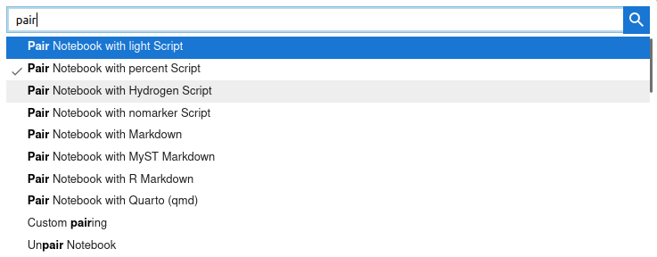

# Paired notebooks

Both classical Jupyter Notebooks in the `.ipynb` format, and [text notebooks](text-notebooks.md), have great qualities. The former is a well established standard, contains all the notebook outputs, while the latter is lighter, easier to edit, and well suited for version control.

_Paired notebooks_ give you the best of both worlds.

They work as follows:
- When a paired notebook is opened, the inputs are loaded from the most recent file in the pair, while the outputs are loaded from the `.ipynb` file, if it exists
- When a paired notebook is saved, all the files in the pair are updated (or recreated) with the new notebook content.

This means, in particular, that you can put under version control only the `.py` or `.md` representation of the notebook. When your collaborators
check-out the updates on the text notebook, open it, then save it in Jupyter, the corresponding `.ipynb` file will be updated or even re-created if necessary.

## How to pair a notebook

In JupyterLab, pair your notebook to one or more text formats with the [Jupytext commands](install.md#jupytext-commands-in-jupyterlab):

These commands simply add a `"jupytext": {"formats": "ipynb,md"}` entry to the notebook metadata.

You can also configure the notebook pairing [globally](config.md) for all your notebooks.

## Can I edit a notebook simultaneously in Jupyter and in a text editor?

When saving a paired notebook, Jupyter updates both the `.ipynb` and its text representation. The text representation can be edited outside of Jupyter. When the notebook is refreshed in Jupyter, the input cells are read from the text file, and the output cells from the `.ipynb` file.

It is possible (and convenient) to leave the notebook open in Jupyter while you edit its text representation. However, you don't want the two editors to save the notebook simultaneously. To avoid this:
- deactivate Jupyter's autosave, and
- make sure you reload the notebook when you switch back from the editor to Jupyter.

In case you forgot to reload, and saved the Jupyter notebook while the text representation had changed, no worries: Jupyter will ask you which version you want to keep:

If that happens, simply select the version that has the most recent changes (or: make a copy of the `.py` notebook on disk, click on _overwrite_ in Jupyter, and reconcile manually the two `.py` files).
