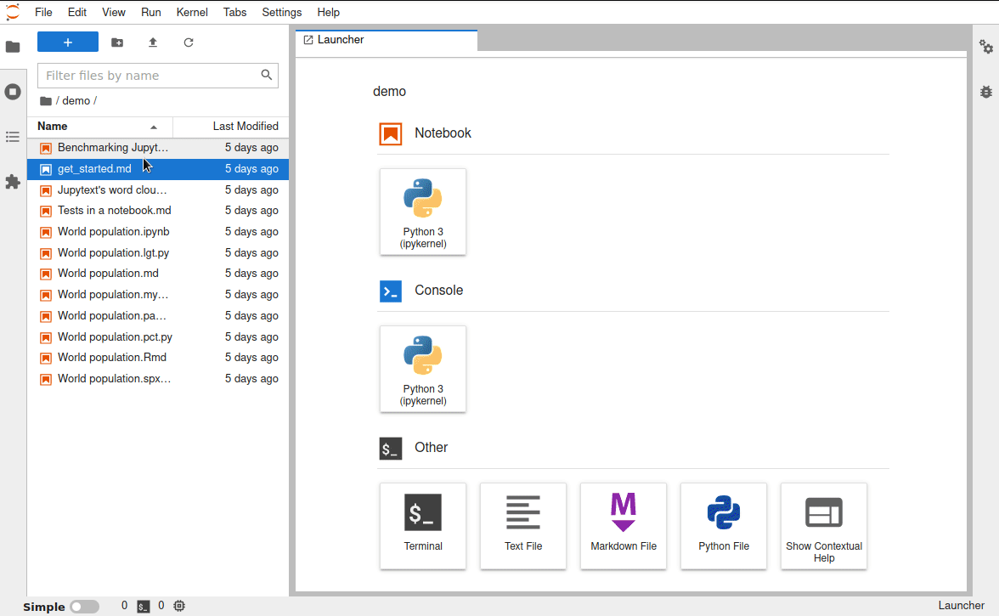

# Text notebooks

Jupytext can save Jupyter Notebooks as text files, with e.g. a `.py` or `.md`
extension. These text files only contain the inputs of your notebooks, as well
as [selected metadata](advanced-options.md#metadata-filtering).

Text notebooks are well suited for version control. They are standard text files
and you can easily edit or refactor them in the editor of your choice.

The outputs of the notebook are not stored on disk, unless you decide to
[pair](paired-notebooks.md) your text notebook to a regular `.ipynb` file.

## How to open a text notebook in Jupyter Lab

Once you have [installed](install.md) Jupytext, `.py` and `.md` files get a
notebook icon in Jupyter. And you can really open and run these files as
notebooks.

### With a right click

Right click on the text notebook, then select _Open With_ → _Notebook_:


Notes:

* you can achieve the same result if you use _Open With_ → _Jupytext Notebook_
* to open links to `.md` files in notebooks with the Notebook editor, you will
  need `jupyterlab>=3.6.0`.

### With a double click

Right clicking and the _Open With_ submenu allows you to choose among several
ways to open a file (several **viewers**, in Jupyter Lab jargon); and when you
double click instead, you open the file using **its default viewer**.

The default viewer for text notebooks is by default configured to be the
**Editor** (which means: text editor); if you'd prefer to have the text files
open as a notebook instead, you have the option to **redefine the default
viewer**, which is something defined for each document type.

Since version 1.15.1, `jupytext` comes with a helper command that allows you to
do this from the command line; and essentially you would just need to run

```bash
jupytext-config set-default-viewer
```

See also [the last section below](#more-on-default-viewers) for alternative
means to change and inspect the default viewers configuration

## How to open a text notebook in Jupyter notebook (nb7)

As of July 2023, Jupyter Notebook now comes as version 7.x - and is known in short as nb7

nb7 being built on top of Jupyter Lab, the principles described above apply as
well in this context; which means that

* you can always right-click a file and select *Open With* → *Notebook*;
* and if you have properly defined the default viewers as described above, you
  can also double-click a file to open it as a notebook.


## How to open a text notebook in Jupyter Notebook (classic)

Previous releases of Jupyter Notebook, i.e. up to version 6, were known as notebook classic

By default, notebook classic opens scripts and Markdown documents as notebooks.
If you want to open them with the text editor, select the document and click on
_edit_:


## How to decide which extensions are notebooks

By default, Jupytext will classify documents with a `.py`, `.R`, `.jl`, `.md`,
`.Rmd`, `.qmd` extension (and more!) as notebooks. If you prefer to limit the
notebook type to certain extensions, you can add a `notebook_extensions` option
to your [Jupytext config file (`jupytext.toml`)](config.md) configuration file
with, for instance, the following value:
```
notebook_extensions = "ipynb,md,qmd,Rmd"
```


## More on default viewers

### `jupytext-config`

This command has more options than the one shown above; in particular:

* you can use `jupytext-config` to set only some of the default viewers; for
  example, if you want to have your `.py` and `.md` files open as a notebook
  when you double-click them e.g.
  `jupytext-config set-default-viewer python markdown`
* you can use `jupytext-config` to inspect the current configuration, e.g.
  `jupytext-config list-default-viewer`
* you can use `jupytext-config unset-default-viewer python` to remove some of the settings

Here's an example of a session, starting from the default config of Jupyter Lab
```bash
# starting from the default config of Jupyter Lab
$ jupytext-config list-default-viewer
# we add the default viewer for 2 doctypes
$ jupytext-config set-default-viewer python markdown
# we check what was done
$ jupytext-config list-default-viewer
python: Jupytext Notebook
markdown: Jupytext Notebook
# we can now remove the default viewer for markdown
$ jupytext-config unset-default-viewer markdown
# and check again
$ jupytext-config list-default-viewer
python: Jupytext Notebook
$
```

### From Jupyter Lab settings dialog

Alternatively to using `jupytext-config`, you can also find the configuration of the default viewers from Jupyter Lab interactively; to do so, go to _Settings_, _Advanced Settings Editor_, and in the JSON view for the `Document Manager` copy-paste the following settings (or the subset that matches your use case):

```json
{
  "defaultViewers": {
    "markdown": "Jupytext Notebook",
    "myst": "Jupytext Notebook",
    "r-markdown": "Jupytext Notebook",
    "quarto": "Jupytext Notebook",
    "julia": "Jupytext Notebook",
    "python": "Jupytext Notebook",
    "r": "Jupytext Notebook"
  }
}
```

Here is a screencast of the steps to follow:


