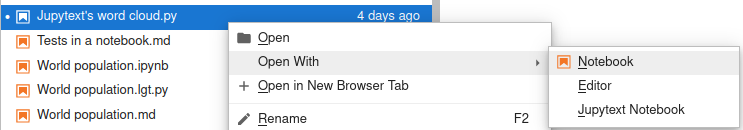

# Text notebooks

Jupytext can save Jupytext Notebooks as text files, with e.g. a `.py` or `.md` extension.
These text files only contain the inputs of your notebooks, as well as [selected metadata](advanced-options.md#metadata-filtering).

Text notebooks are well suited for version control. They are standard text files and you can easily edit
or refactor them in the editor of your choice.

The outputs of the notebook are not stored on disk, unless you decide to [pair](paired-notebooks.md) your text notebook to a regular `.ipynb` file.

Once you have [installed](install.md) Jupytext, `.py` and `.md` files get a notebook icon in Jupyter. And you can really open and run these files as notebooks.

## How to open a text notebook in Jupyter Lab

### With a right click

Right click on the text notebook, then select _open with Notebook_:



### With a single click

It is possible to open text notebooks in Jupyter Lab as notebooks with a single click. To do so, go to _Settings_, _Advanced Settings Editor_, and in the JSON view for the `Document Manager` copy-paste the following settings (or the subset that matches your use case):

```json
{
  "defaultViewers": {
    "markdown": "Jupytext Notebook",
    "myst": "Jupytext Notebook",
    "r-markdown": "Jupytext Notebook",
    "quarto": "Jupytext Notebook",
    "julia": "Jupytext Notebook",
    "python": "Jupytext Notebook",
    "r": "Jupytext Notebook"
  }
}
```

Here is a screencast of the steps to follow:


Another possibility is to activate this with a [default_setting_overrides.json](../binder/labconfig/default_setting_overrides.json) file in the `.jupyter/labconfig` folder with e.g.
```
wget https://raw.githubusercontent.com/mwouts/jupytext/main/binder/labconfig/default_setting_overrides.json -P  ~/.jupyter/labconfig/
```

Note: to open links to `.md` files in notebooks with the Notebook editor, you will need `jupyterlab>=3.6.0`.


## How to open a text notebook in Jupyter Notebook

By default, Jupyter Notebook open scripts and Markdown documents as notebooks. If you want to open them with the text editor, select the document and click on _edit_:


## How to decide which extensions are notebooks

By default, Jupytext will classify documents with a `.py`, `.R`, `.jl`, `.md`, `.Rmd`, `.qmd` extension (and more!) as notebooks. If you prefer to limit the notebook type to certain extensions, you can add a `notebook_extensions` option to your [`jupytext.toml`](config.md) configuration file with, for instance, the following value:
```
notebook_extensions = "ipynb,md,qmd,Rmd"
```
