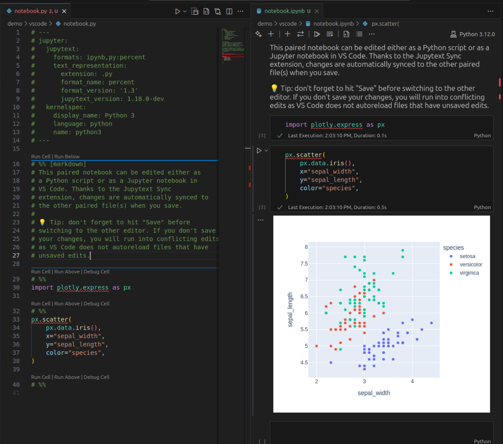

# VS Code

## The Jupytext Sync Extension

You can get the same pairing and synchronization functionality in VS Code as in Jupyter, thanks to the [Jupytext Sync](https://marketplace.visualstudio.com/items?itemName=caenrigen.jupytext-sync) extension for VS Code. The extension is developed by Victor Negîrneac on [GitHub](https://github.com/caenrigen/vscode-jupytext-sync) under a MIT license.

### Installation

Install the extension from the [VS Code Marketplace](https://marketplace.visualstudio.com/items?itemName=caenrigen.jupytext-sync) or search for "Jupytext Sync" in the VS Code Extensions view.

### Usage

With the Jupytext Sync extension active, open both the `.ipynb` and `.py` paired files in your editor. When you save changes to either file, they are automatically propagated to the other paired file(s).

💡 **Tip:** Save your changes before switching editors. If a file has unsaved edits, VS Code will not auto-reload it when the paired file is saved, until you either save (overwrite) or revert your changes.

### Configuration

The Jupytext Sync extension is aware of your `jupytext.toml` or `pyproject.toml` [configuration files](config.md), so you can use those to pair your notebooks or control which metadata you want in the text notebooks.

The extension also gives you the option to pair the notebooks individually. Read more about these features in the extension's [documentation](https://marketplace.visualstudio.com/items?itemName=caenrigen.jupytext-sync).

### Requirements

The Jupytext Sync extension requires Jupytext 1.17.3 or later to properly identify which files are paired. Additionally, the `jupytext --sync` command gained the ability to detect simultaneous modifications in Jupytext 1.18.0, so we recommend updating to the latest version if possible.
