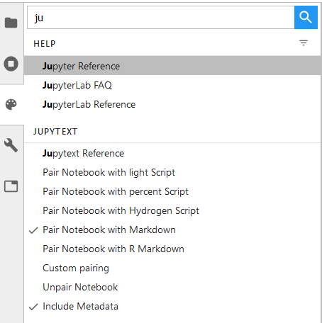

# A JupyterLab extension for Jupytext

This extension adds a few [Jupytext](https://github.com/mwouts/jupytext) commands to the command palette. Use these to select the desired ipynb/text pairing for your notebook.



## Installation

Please [install Jupytext](https://github.com/mwouts/jupytext/blob/master/README.md#installation) first. Then, rebuild JupyterLab with

```bash
jupyter lab build
```

In case you're not using JupyterLab 1.0, you may have to install another version of the extension that is compatible with your version. For instance, install the last version of the extension compatible with Jupyter 0.35 with

```bash
jupyter labextension install jupyterlab-jupytext@0.19
```

# How to develop this extension

We developed the extension following the [xkcd extension tutorial](https://jupyterlab.readthedocs.io/en/stable/developer/xkcd_extension_tutorial.html). Follow the instructions there to create a conda environment in which you will be able to develop the extension. In that environment, install JupyterLab's plugin manager, and the extension with
```bash
jlpm install
jupyter labextension install . --no-build
```

Then, in another shell on the same environment, start JupyterLab:
```bash
jupyter lab --watch
```

Finally, make changes to the extension and rebuild it (in the first shell) with:
```bash
jlpm run build
```

Refresh the JupyterLab interface and see your changes in action.

# How to publish a new version of the extension

Bump the version in `package.json`. 

Build the new version of `jupyterlab-jupytext-xxx.tgz` with

```bash
npm pack
```

and remove any previous version. That package will be included in the Jupytext Python package.

If you wish, you may also update the package on npm with

```bash
npm publish --access=public
```

