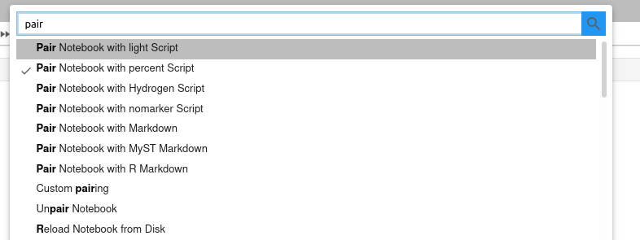

# A JupyterLab extension for Jupytext

This extension adds a few [Jupytext](https://github.com/mwouts/jupytext) commands to the command palette. Use these to select the desired ipynb/text pairing for your notebook.



## Installation

Please [install Jupytext](https://github.com/mwouts/jupytext/blob/master/README.md#installation) first. The lab extension is bundled with the Python package.

If you prefer to use the extension that is distributed on npm, run:

```bash
jupyter labextension install jupyterlab-jupytext
```

In all cases, the extension will work only if Jupytext's content manager is active in Jupyter - make sure Markdown documents and scripts have a notebook icon.

# How to develop this extension

We started developping the extension following the [xkcd extension tutorial](https://jupyterlab.readthedocs.io/en/stable/developer/xkcd_extension_tutorial.html). Follow the instructions there to create a conda environment in which you will be able to develop the extension. 

We also recommend to use `node` in version 11 at least. To this aim, you can use node from `conda-forge`:
```bash
conda install nodejs -c conda-forge
```

In that environment, install JupyterLab's plugin manager, and the extension with
```bash
jlpm install
jupyter labextension install . --no-build
```

Then, in another shell on the same environment, start JupyterLab:
```bash
jupyter lab --watch
```

Finally, make changes to the extension and rebuild it (in the first shell) with:
```bash
jlpm run build
```

Refresh the JupyterLab interface and see your changes in action.

# How to publish a new version of the extension

Bump the version in `package.json`. 

Build the new version of `jupyterlab-jupytext-xxx.tgz` with 

```bash
npm pack
```

Remove any previous version. And update the link to the new version in `setup.py` at the project root.

If you wish, you may also update the package on npm with

```bash
npm publish --access=public
```

